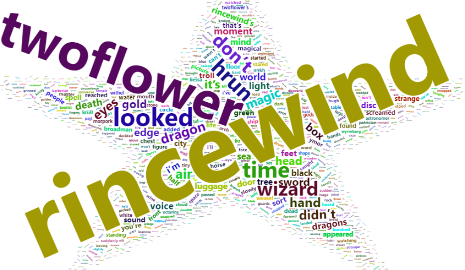
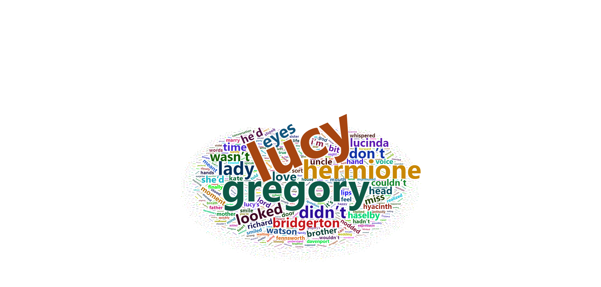
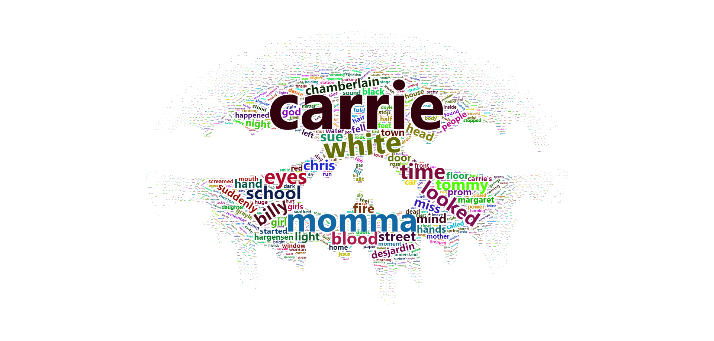

```{r setup, include=FALSE}
knitr::opts_chunk$set(echo = TRUE)
```

In this worksheet we will be using R to perform document classification and produce different visualisations illustrating each of the different techniques. All the data required for this practical is available on the DLE. 

The data is contained in the three files \texttt{text\_1.txt}, \texttt{text\_2.txt} and \texttt{text\_3.txt}. Each file contains the text from an entire book. Each book is from a different genre, the genres are horror, fantasy and romance. Your tasks are to apply each of the methods below and classify the texts to the correct genre. 

```{r,warning=FALSE,message=FALSE}
## Libraries required 

library(tidyverse)
library(tidytext)
library(wordcloud)
library(wordcloud2)
library(tm)
```

## Exercise 1 - Bag-of-words

The first exercise is to apply the basic technique, bag-of-words, to each of the texts. As we saw in the lecture, there will be common words in all the texts which will occupy the "top spots" when we count the frequencies. Included the in the \texttt{tidytext} package is a dictionary of stop words (common words), we can use the \texttt{anti\_join()} function to remove these from our text.

Visualise the results as a word cloud and a bar chart showing the top 15 most common words.

\textbf{Solution}

```{r,message=FALSE,warning=FALSE}

## Read in the data
book_1<-read.delim("../Lab Sheets/text_1.txt",header = FALSE)
book_2<-read.delim("../Lab Sheets/text_2.txt",header = FALSE)
book_3<-read.delim("../Lab Sheets/text_3.txt",header = FALSE)


## Tokenise the data

book_1_words<-book_1 %>% select(V1) %>%  unnest_tokens(word, V1)
book_2_words<-book_2 %>% select(V1) %>%  unnest_tokens(word, V1)
book_3_words<-book_3 %>% select(V1) %>%  unnest_tokens(word, V1)

## Remove the stop words

book_1_words_clean<-book_1_words %>% anti_join(stop_words)
book_2_words_clean<-book_2_words %>% anti_join(stop_words)
book_3_words_clean<-book_3_words %>% anti_join(stop_words)
```

Visualise as a bar plot:

```{r}
## Plotting the top 15 words in a bar chart

book_1_words_clean %>% group_by(word) %>% count(sort = TRUE) %>% head(15) %>% 
  ggplot( aes(x = word, y = n)) +
  geom_col(fill = "cyan", color = "blue") +
  coord_flip() +
  labs(x = "Unique words",
       y = "Frequency",
       title = "Count of unique words found") + 
  theme(axis.text = element_text(size = 12, color = "black"), 
        axis.title = element_text(size = 12, color = "black"),
        title = element_text(size = 14))

book_2_words_clean %>% group_by(word) %>% count(sort=TRUE) %>% head(15) %>% 
  ggplot( aes(x = word, y = n)) +
  geom_col(fill = "cyan", color = "blue") +
  coord_flip() +
  labs(x = "Unique words",
       y = "Frequency",
       title = "Count of unique words found") + 
  theme(axis.text = element_text(size = 12, color = "black"), 
        axis.title = element_text(size = 12, color = "black"),
        title = element_text(size = 14))

book_3_words_clean %>% group_by(word) %>% count(sort = TRUE) %>% head(15) %>% 
  ggplot( aes(x = word, y = n)) +
  geom_col(fill = "cyan", color = "blue") +
  coord_flip() +
  labs(x = "Unique words",
       y = "Frequency",
       title = "Count of unique words found") + 
  theme(axis.text = element_text(size = 12, color = "black"), 
        axis.title = element_text(size = 12, color = "black"),
        title = element_text(size = 14))
```

\textcolor{blue}{We see in text 1 that words lsuch as wizard, magic and dragon are common, therefore we could classify this text as fantasy. In text 2 we see names of characters appearing frequently and the word love is a common word, this could lead us to classifying this text as romance. The final text, text 3 has Carrie as the most common word, this is probably the main charaters name and we see the word blood has a high frequency which would lead us to classifing this text as horror.}


```{r,eval=FALSE}
## Word cloud for each text

book_1_text_wordcloud<- book_1_words_clean %>%
  count(word, sort = TRUE) %>% 
  mutate(freq = n / sum(n))

book_2_text_wordcloud<- book_2_words_clean %>%
  count(word, sort = TRUE) %>% 
  mutate(freq = n / sum(n))

book_3_text_wordcloud<- book_3_words_clean %>%
  count(word, sort = TRUE) %>% 
  mutate(freq = n / sum(n))

book_1_text_wordcloud<-book_1_text_wordcloud %>% select(word,freq)
book_2_text_wordcloud<-book_2_text_wordcloud %>% select(word,freq)
book_3_text_wordcloud<-book_3_text_wordcloud %>% select(word,freq)

wordcloud2(book_1_text_wordcloud,color = "random-dark",shape="star")
wordcloud2(book_2_text_wordcloud,color = "random-dark",shape="cardioid")
wordcloud2(book_3_text_wordcloud,figPath = "skull.jpg")

```






\textcolor{blue}{}


## Exercise 2 - N-grams

The second exercise is to extend the bag-of-words method to n-grams. The number of words to be included as up to you, there may be an element of trial and error to find the n-gram which is the most useful. 

As with the first exercise, you will need to ensure that stop words have been removed. 


Visualise the results as a word cloud and a network plot showing the connections within the text.

\textbf{Solution}

## Exercise 3 - tf-idf

For the third exercise we will be calculating the tf-idf values for each text using the \texttt{bind\_tf\_idf()} function. Once again you will need to remove the stop words from the text and plot your results on a bar plot.

\textbf{Solution}

## Exercise 4 - Zipf's Law

In the final exercise, you will be applying Zipf's Law to each of the texts. For this we need the term frequency which is calculated in the function used for exercise 3. You will then need to create a column which contains the rank of each word, grouped by text, in descending order, i.e. the word with the highest tf value has rank 1.

Show your results on a line plot, plotting the log of the rank against the log of the term frequency, and add the linear equation for each line to the plot.

\textbf{Solution}

